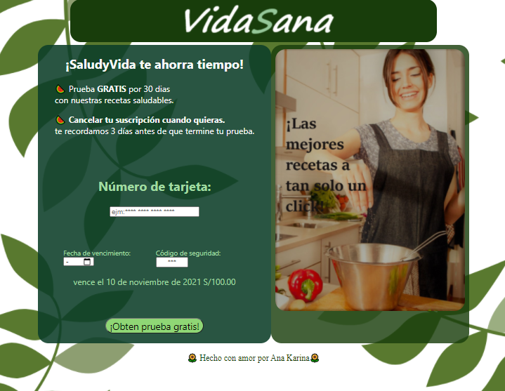

 ## ✔️1. Definición del producto

- Es una pagina web que le permite a un usuario validar el número de una tarjeta de crédito. Además, tendrás que
tiene funcionalidad para ocultar todos los dígitos de una tarjeta menos
los últimos cuatro.

- la tematica de de esta web se basa en ofrecer una suscripcion de un mes  que contiene una amplia variedad de recetas saludables para un menu completo toda la semana, ademas  la plataforma ofrece diferentes actividades de manera online como clases de yoga, club de lectura, entre otros. Creando una comunidad virtual con personas que quieren lograr los mismo cambios alimenticios.  

  ## ✔️2. Plan de acción

- Realizar historias de usuario.

### **UX**

- Diseñar la aplicación pensando y entendiendo al usuario.
- Crear prototipos para obtener feedback e iterar.

### **HTML y CSS*

- Uso de HTML semántico.
- Uso de selectores de CSS.
- Uso de flexbox en CSS.

### **JavaScript**

- Uso de condicionales.
- Uso de bucles.
- Uso de funciones (parámetros | argumentos | valor de retorno).
- Manipular arrays (filter | map | sort | reduce).
- Manejo de eventos.

### **DOM y Web APIs**

- Uso de selectores del DOM.
- Manejo de eventos del DOM.
- Manipulación dinámica del DOM.

### **Git y GitHub**

- Uso de comandos de git (add | commit | pull | status | push).
- Manejo de repositorios de GitHub (clone | fork | gh-pages)
- Colaboración en Github (branches | pull requests )

## ✔️3. Diseño:

## ✔️3. Autora

Ana karina González López.&#128151;